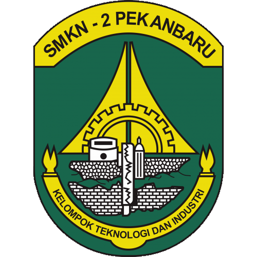

<a id="readme-top"></a>
<!-- PROJECT LOGO -->
<br />
<div align="center">
  <a href="https://github.com/RaffaEkaPrayoga/minimarket-raffa-v2.git">
    
  </a>

<h3 align="center">Sistem Informasi Sekolah</h3>

  <p align="center">
    Sistem Informasi Sekolah dengan berbagai fitur yang memudahkan pengelolaan data siswa, guru, ujian, dan nilai.
    <br />
    <a href="#getting-started">Getting Started</a>
    ·
    <a href="#about-the-project">About The Project</a>
  </p>
</div>

<!-- TABLE OF CONTENTS -->
<details>
  <summary>Table of Contents</summary>
  <ol>
    <li>
      <a href="#about-the-project">About The Project</a>
      <ul>
        <li><a href="#database-structure">Database Structure</a></li>
        <li><a href="#roles">Roles</a></li>
        <li><a href="#template">Template</a></li>
        <li><a href="#built-with">Built With</a></li>
      </ul>
    </li>
    <li>
      <a href="#getting-started">Getting Started</a>
      <ul>
        <li><a href="#prerequisites">Prerequisites</a></li>
        <li><a href="#installation">Installation</a></li>
      </ul>
    </li>
    <li><a href="#acknowledgments">Acknowledgments</a></li>
  </ol>
</details>

<!-- ABOUT THE PROJECT -->

## About The Project

[![Sistem-Informasi-Sekolah][product-screenshot]]()

Sistem Informasi Sekolah ini dibuat untuk mempermudah pengelolaan data sekolah, termasuk data siswa, guru, pelajaran, ujian, dan nilai ujian. Website ini dibangun menggunakan template SB Admin yang responsif dan mudah digunakan. Terdapat tiga role utama di dalam sistem ini: Super Admin, Admin, dan User, masing-masing dengan hak akses yang berbeda-beda.

### Database Structure

Nama database yang digunakan adalah `db_sekolah`. Berikut adalah tabel-tabel yang tersedia dalam database:

1. **Tabel Sekolah**: Menyimpan data tentang sekolah.
2. **Tabel User**: Menyimpan data pengguna sistem.
3. **Tabel Pelajaran**: Menyimpan data mata pelajaran.
4. **Tabel Siswa**: Menyimpan data siswa.
5. **Tabel Guru**: Menyimpan data guru.
6. **Tabel Ujian**: Menyimpan data ujian yang diadakan.
7. **Tabel Nilai Ujian**: Menyimpan data nilai ujian siswa.

### Roles

Di dalam website ini terdapat 3 role user dengan rincian sebagai berikut:

- **Super Admin** 
  **Username**: SuperAdmin  
  **Password**: 1234

- **Admin**
  **Username**: Admin  
  **Password**: 1234

- **User**
  **Username**: User  
  **Password**: 1234

### Template

Website ini menggunakan template **SB Admin** yang menyediakan antarmuka pengguna yang modern dan responsif. Template ini cocok digunakan untuk dashboard administrasi.

### Built With

Website ini dibangun menggunakan teknologi berikut:

- **PHP**: Bahasa pemrograman utama untuk server-side scripting.
- **MySQL**: Database yang digunakan untuk menyimpan data.
- **Bootstrap**: Framework CSS untuk mendesain antarmuka pengguna yang responsif.
- **Font Awesome**: Library ikon yang digunakan untuk mempercantik tampilan.

<p align="right">(<a href="#readme-top">back to top</a>)</p>

<!-- GETTING STARTED -->

## Getting Started

Pastikan Anda telah mendownload dan menginstall <a href="https://git-scm.com/downloads">Git</a> dan <a href="https://nodejs.org/">Node.js</a> (termasuk npm). Ikuti langkah-langkah berikut untuk memulai.

### Prerequisites

Pastikan `npm` sudah terinstall di sistem Anda.

- Untuk mengecek versi npm:

  ```sh
  npm -v

- Untuk mengupdate npm ke versi terbaru:

    ```sh
    sudo npm install npm --global

### Installation

- Buka Git Bash di direktori tempat Anda ingin menyimpan project.

- Masuk ke direktori yang diinginkan:

    ```sh
    cd nama-direktori
- Clone repository ini ke sistem Anda:

   ```sh
    git clone https://github.com/RaffaEkaPrayoga/Sistem-Informasi-Sekolah.git
Atau, Anda bisa mendownload file ZIP dari repository ini.

<p align="right">(<a href="#readme-top">back to top</a>)</p>

### Acknowledgments
- [Stisla Template](https://github.com/stisla/stisla)
- [Font Awesome](https://fontawesome.com/icons)
- [Bootstrap](https://getbootstrap.com/)
<p align="right">(<a href="#readme-top">back to top</a>)</p>

[product-screenshot]: asset/image/ss-dashboard.png